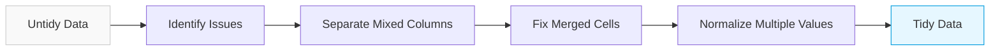
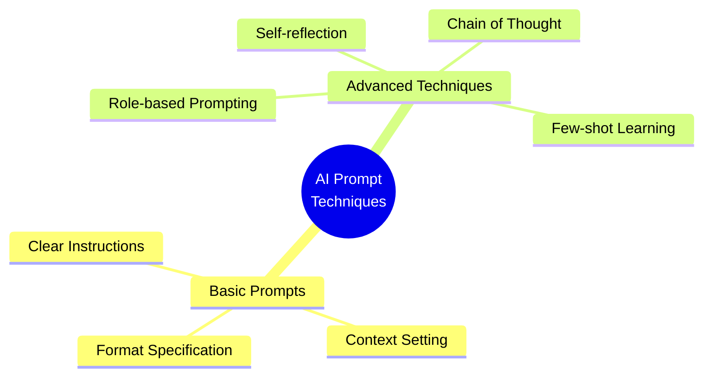
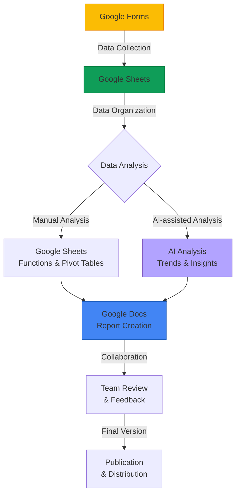
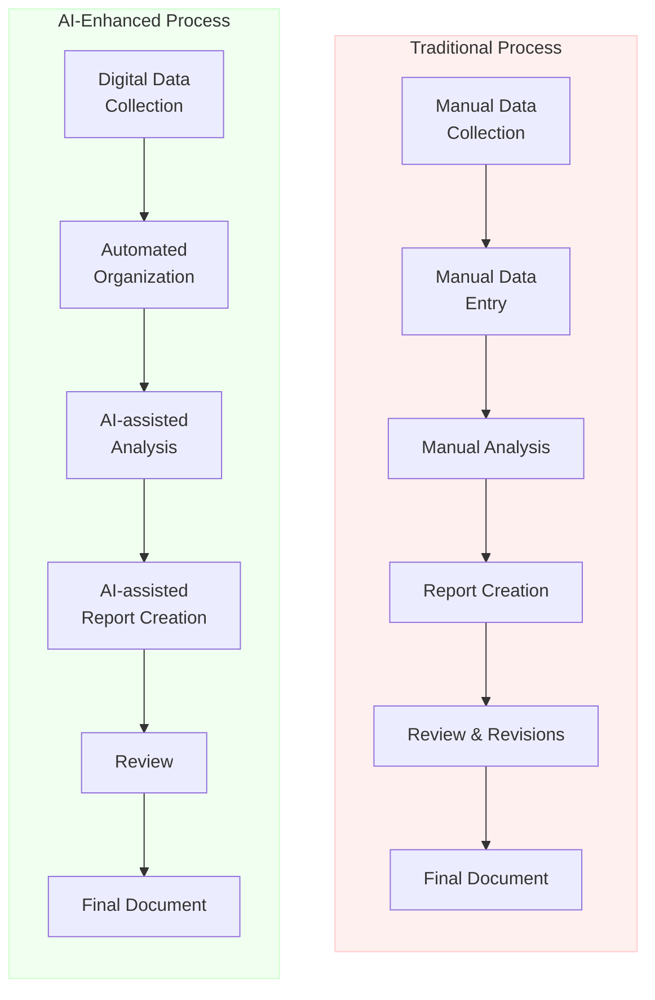
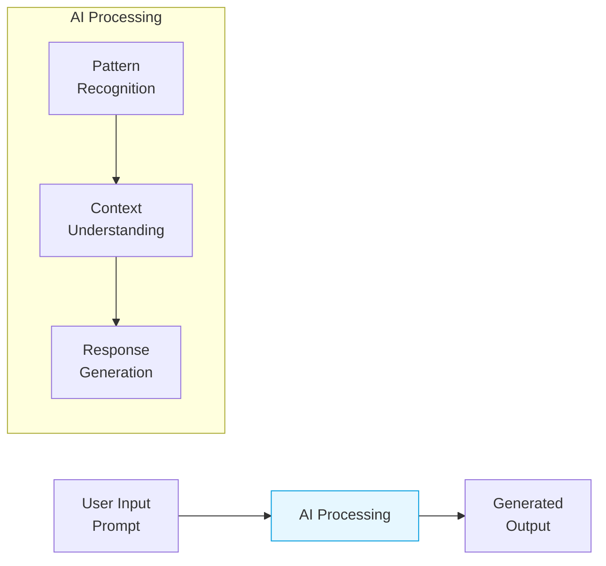

# Diagram Enhancement Plan for AI for Admins Workshop

This document outlines the plan to enhance the workshop presentation with mermaid diagrams for improved clarity and visual appeal.

## Diagram Opportunities

### 1. Tidy Data Transformation Flow (`04_tidy_data.md`)
**Purpose:** Visualize the process of transforming untidy data to tidy data format  
**Description:** A flowchart showing the step-by-step transformation process  
**Benefits:** Helps participants understand the practical steps in data cleaning  

### 2. AI Prompt Engineering Techniques (`05_ai_tools.md`)
**Purpose:** Show different prompt engineering approaches and their relationships  
**Description:** A hierarchical diagram showing prompt techniques and use cases  
**Benefits:** Creates a visual reference for different prompting strategies  

### 3. Digital Tools Workflow Integration (`08_integration.md`)
**Purpose:** Illustrate how different tools connect and data flows between them  
**Description:** A flowchart showing the integration of Google Workspace and AI tools  
**Benefits:** Demonstrates the end-to-end process visually  

### 4. Before/After Process Comparison (`07_ai_case_studies.md`)
**Purpose:** Compare traditional workflows with AI-enhanced workflows  
**Description:** A side-by-side comparison diagram showing process improvements  
**Benefits:** Clearly illustrates time and effort savings  

### 5. AI Conceptual Model (`03_ai_intro.md`)
**Purpose:** Simplify the concept of how AI works  
**Description:** A basic flow diagram showing AI processing  
**Benefits:** Demystifies AI for non-technical administrators  

## Aesthetic Considerations

### Color Scheme
- Use Prince of Songkla University's official colors:
  - PSU Blue: #003C71 (primary color)
  - PSU Light Blue: #009CDE (secondary color)
  - Complementary accent colors for highlights
- Maintain consistent color usage across all diagrams
- Use light backgrounds with darker outlines for readability

### Typography
- Keep text concise and readable
- Use hierarchical text sizing for diagram labels
- Ensure text contrasts well with background colors
- Keep consistent terminology with the rest of the presentation

### Layout
- Maintain left-to-right or top-to-bottom flow for process diagrams
- Use appropriate spacing between elements
- Limit diagram complexity - focus on key concepts
- Balance text and visual elements
- Ensure diagrams are responsive and visible on different screen sizes

### Cultural Considerations
- Include Thai terms alongside English where appropriate
- Design with consideration for Thai aesthetic preferences
- Ensure examples relate to university administrative contexts

## Implementation Plan

1. Prioritize diagrams in this order:
   - Digital Tools Workflow Integration (highest impact)
   - Before/After Process Comparison
   - Tidy Data Transformation Flow
   - AI Prompt Engineering Techniques
   - AI Conceptual Model

2. Create one diagram at a time, integrate into slides, and test

3. Gather feedback and refine diagrams as needed

4. Ensure all diagrams work properly with the slidev presentation framework

5. Finalize documentation including diagram source code